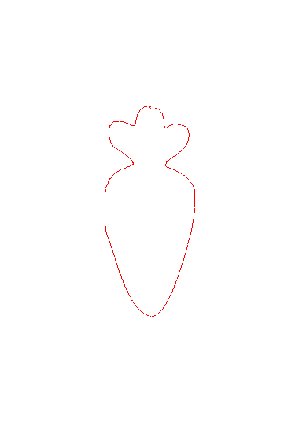

# Drawing Robot Code for OpenManipulator-X
This repository contains a tutorial for the drawing-robot task using OpenManipulator-X.

## Before You Start

We use a pen asset from [Thingiverse](https://www.thingiverse.com/thing:4087741).  
However, since this asset does not include an explicit license or copyright notice, we recommend that you either download the model yourself or use a different asset suitable for your own pen design.

Download (or create) your pen asset and save it in the [openmanipulator_x asset directory](./asset/openmanipulator_x/) as `touch_pen.stl`.

## Requirements
```
cvxpy==1.6.2
dynamixel_sdk==3.7.31
glfw==2.8.0
ipython==8.12.3
matplotlib==3.5.1
mujoco==3.3.2
numpy==1.24.4
Pillow==11.2.1
PyAutoGUI==0.9.54
PyQt5==5.15.11
PyQt5_sip==12.9.1
scipy==1.8.0
Shapely==2.1.0
termcolor==3.1.0
```

You can simply download it using ```pip install -r requirements.txt```

## Major Modifications in OpenManipulator-MJCF

The MuJoCo XML file is located at [omx_drawing.xml](./asset/omx_drawing.xml).

  

We've added a crank-slider mechanism for the gripper.

You can now obtain the exact `qpos` of the gripper-control motor.

We fixed the pen model directly in this XML file.  
If you'd like to extend the project with pick-and-place functionality, you can remove the pen from this XML, create a separate MJCF file for the pen, and then add it to [scene_drawing.xml](./asset/openmanipulator_x/scene_drawing.xml).

## Drawing Robot

The main code is provided in [drawing_OpenManipulator.ipynb](./notebook/drawing/drawing_OpenManipulator.ipynb).  
This notebook allows you to draw images in both simulation and real-world environments.

### Sim2Real Movement (click to watch on YouTube)

[](https://youtube.com/shorts/FluVTLvg_JM)

### Results

<table>
  <tr>
    <th>Input</th>
    <th>Output</th>
  </tr>
  <tr>
    <td></td>
    <td></td>
  </tr>
</table>

<table>
  <tr>
    <th>Drawing (Simulation)</th>
    <th>Drawing (Real) — Click to watch on YouTube</th>
  </tr>
  <tr>
    <td></td>
    <td>
      <a href="https://youtube.com/shorts/mz_u8uAfy-o">
        
      </a>
    </td>
  </tr>
</table>

## Todo
* Update constant-velocity trajectory planning pipeline


## Acknowledgements

* The robot asset for the ROBOTIS OpenManipulator-X is from [robotis_open_manipulator](https://github.com/ROBOTIS-GIT/open_manipulator/tree/main/open_manipulator_description/urdf/om_x)
* The [mujoco_helper](./package/mujoco_helper), [kinematics_helper](./package/kinematics_helper/), [utility](./package/utility/) is adapted and modified from [yet-another-mujoco-tutorial](https://github.com/sjchoi86/yet-another-mujoco-tutorial-v3)
* The [openmanipulator](./package/openmanipulator) package is based on [DynamixelSDK](https://github.com/ROBOTIS-GIT/DynamixelSDK)
